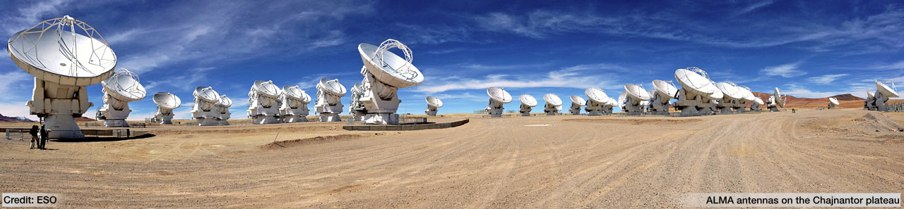

.. galario documentation master file, created by
   sphinx-quickstart on Wed May 24 13:32:58 2017.
   You can adapt this file completely to your liking, but it should at least
   contain the root `toctree` directive.

=========
|galario|
=========
--------------

**GPU Accelerated Library for Analysing Radio Interferometer Observations**
---------------------------------------------------------------------------

|galario| is a library that exploits the computing power of modern graphic cards (GPUs) to accelerate the comparison of model
predictions to radio interferometer observations. Namely, it speeds up the computation of the synthetic visibilities
given a model image (or an axisymmetric brightness profile) and their comparison to the observations.

Along with the GPU accelerated version based on the
`CUDA Toolkit <https://developer.nvidia.com/cuda-toolkit>`_, |galario| offers a CPU counterpart accelerated with
`openMP <http://www.openmp.org>`_.

Modern radio interferometers like
`ALMA <http://www.almaobservatory.org/en/home/>`_,
`Karl G. Jansky VLA <https://science.nrao.edu/facilities/vla>`_,
`NOEMA <http://www.iram-institute.org/EN/noema-project.php?ContentID=9&rub=9&srub=0&ssrub=0&sssrub=0>`_
are pushing to the extreme the computational efforts needed to model the observations.
The unprecedented sensitivity and resolution achieved by these observatories deliver huge amount of data that sample a wide range of spatial frequencies.
In this context, |galario| provides a fast library useful for comparing a model to observations directly in the Fourier plane.

We presented |galario| in `Tazzari, Beaujean and Testi (2018) MNRAS 476 4527 <https://doi.org/10.1093/mnras/sty409>`_, where you can find more details about the
relevant equations and the algorithm implementation.
Here we do not aim to summarize the vast literature about Radio Interferometry, but we refer the interested reader to the
`Synthesis Imaging in Radio Astronomy II <http://aspbooks.org/a/volumes/table_of_contents/180>`_ book.

|galario| is actively developed on `GitHub <https://github.com/mtazzari/galario/>`_
and has already been employed in :doc:`these published studies <studies>`.

Instructions on how to build and install |galario| can be found :doc:`here <install>`.

More details on how to get started with |galario| are given in the :doc:`Quickstart example <quickstart>`.

Be sure to checkout also the :doc:`Cookbook <cookbook>` with many useful code snippets!

Basic Usage
-----------
.. |u_j| replace:: :math:`u_j`
.. |v_j| replace:: :math:`v_j`
.. |w_j| replace:: :math:`w_j`

Let's say you have an observational dataset of `M` visibility points located at :math:`(u_j, v_j)`, with :math:`j=1...M` and |u_j|, |v_j| expressed in units of the observing wavelength. :math:`V_{obs\ j}` (Jy) is the :math:`j`-th complex visibility with associated theoretical weight |w_j|.
With |galario| you can:

**1) Compute visibilities from a model image**

    If you want to compute the visibilities of a model :code:`image` (Jy/px) with pixel size `dxy` (rad) in the same :math:`(u_j, v_j)` locations of the observations, you can easily do it with the GPU accelerated |galario|:

    .. code-block:: python

        from galario.double_cuda import sampleImage

        vis = sampleImage(image, dxy, u, v)

    where `vis` is a complex array of length :math:`N` containing the real (`vis.real`) and imaginary (`vis.imag`) part of the synthetic visibilities.

**2) Compute visibilities from an axisymmetric brightness profile**

    If you want to compare the observations with a model characterized by an **axisymmetric brightness profile**, |galario| offers dedicated functions that exploit the symmetry of the model to accelerate the image creation.

    If :math:`I(R)` (Jy/sr) is the radial brightness profile, the command is as simple as:

    .. code-block:: python

        from galario.double_cuda import sampleProfile

        vis = sampleProfile(I, Rmin, dR, nxy, dxy, u, v)

    where `Rmin` and `dR` are expressed in radians and are the innermost radius and the cell size of the grid on which :math:`I(R)` is computed. An analogous function
    `chi2Profile` allows one to compute directly the chi square.

**3) Compute the** :math:`\chi^2` **of a model (image or brightness profile)**

    If you are doing a **fit** and the only number you are interested in is the :math:`\chi^2` for the likelihood computation, you can use directly one of these:

    .. code-block:: python

        from galario.double_cuda import chi2Image

        chi2 = chi2Image(image, dxy, u, v, V_obs.real, V_obs.imag, w)
        chi2 = chi2Profile(I, Rmin, dR, nxy, dxy, u, v, V_obs.real, V_obs.imag, w)

**4) Do all the above operations + translate and rotate the model image**

    To translate the model image in Right Ascension and Declination direction by (dRA, dDec) offsets (rad),
    or to rotate the image by a Position Angle PA (rad) (defined East of North), you can specify them as optional parameters.

    This works for all the `sampleImage`, `sampleProfile`, `chi2Image` and `chi2Profile` functions:

    .. code-block:: python

        from galario.double_cuda import sampleImage

        vis = sampleImage(image, dxy, u, v, dRA=dRA, dDec=dDec, PA=PA)

.. note::
    If you work on a machine **without** a CUDA-enabled GPU, don't worry: you can use the CPU version
    of |galario| by just removing the subscript `"_cuda"` from the imports above and benefit from the openMP parallelization.
    All the function names and interfaces are the same for the GPU and CPU versions!

License and Attribution
-----------------------
If you use |galario| for your research please cite Tazzari, Beaujean and Testi (2018) MNRAS **476** 4527 `[MNRAS] <https://doi.org/10.1093/mnras/sty409>`_ `[arXiv] <https://arxiv.org/abs/1709.06999>`_ `[ADS] <http://adsabs.harvard.edu/abs/2018MNRAS.476.4527T>`_.

The BibTeX entry for the paper is::

    @ARTICLE{2018MNRAS.476.4527T,
       author = {{Tazzari}, M. and {Beaujean}, F. and {Testi}, L.},
        title = "{GALARIO: a GPU accelerated library for analysing radio interferometer observations}",
      journal = {\mnras},
    archivePrefix = "arXiv",
       eprint = {1709.06999},
     primaryClass = "astro-ph.IM",
     keywords = {methods: numerical, techniques: interferometric, submillimetre: general},
         year = 2018,
        month = jun,
       volume = 476,
        pages = {4527-4542},
          doi = {10.1093/mnras/sty409},
       adsurl = {http://adsabs.harvard.edu/abs/2018MNRAS.476.4527T},
      adsnote = {Provided by the SAO/NASA Astrophysics Data System}
    }

|galario| has also a `Zenodo DOI <https://doi.org/10.5281/zenodo.891039>`_, which can be used to refer to the exact
version of |galario| used in a paper.

|galario| is free software licensed under the LGPLv3 License. For more details see the :doc:`LICENSE <license>`.

© Copyright 2017-2018 Marco Tazzari, Frederik Beaujean, Leonardo Testi.

Contents
--------
.. toctree::
    :maxdepth: 2

    install
    quickstart
    cookbook
    py-api
    C++-api
    C++-example
    studies
    license

Indices
-------
* :ref:`genindex`
* :ref:`search`
